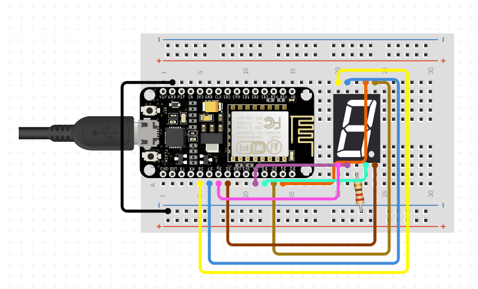
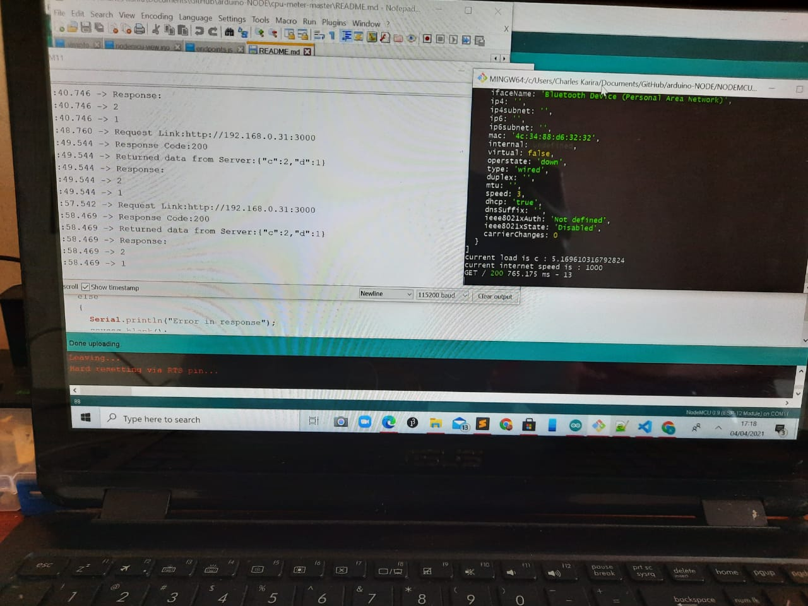
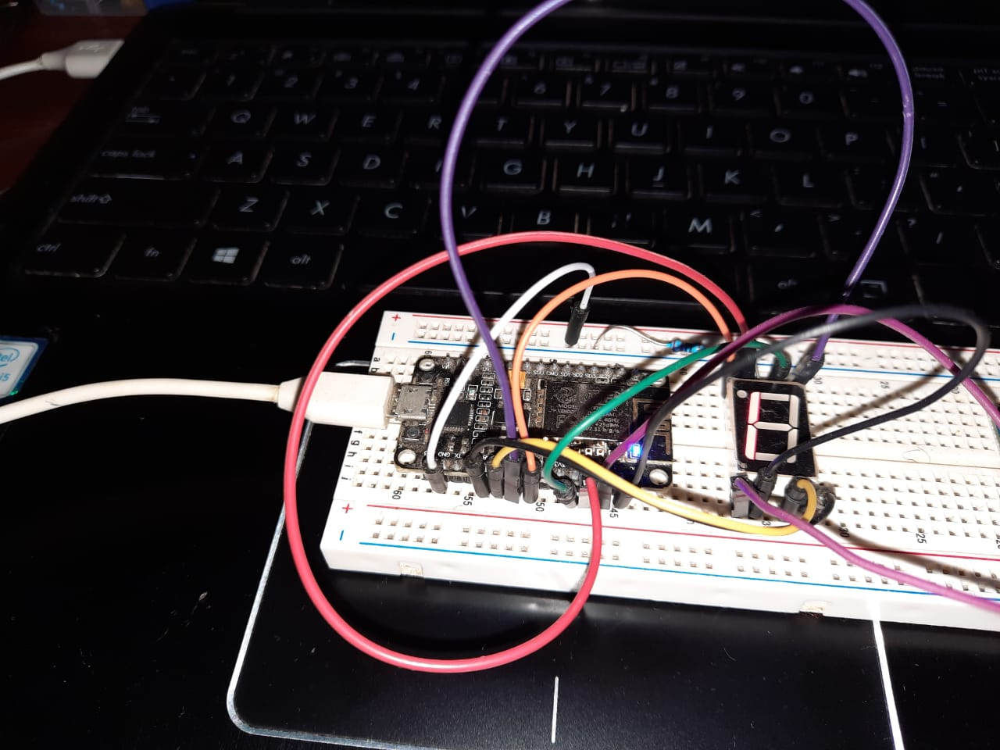

# CPU-MONITOR USING NODEMCU AND NODE.JS
CPU Monitor using NodeJS backend and view using NODEMCU with a 7 Segment LED

# Using [systeminformation](https://github.com/sebhildebrandt/systeminformation)
## Quickstart

```bashardui
npm install systeminformation
``` 
This package allows user to get systeminformation of your machine in a simple way just by running the functions predefined.

For this project we will be using `si.currentLoad` and `si.networkInterfaces` to get the CPULOAD and network Speed of our machine which is then sent to the nodeMCU.

## How to use

### Set up CPU MONITOR

1. Clone the repository

2. Install the packages on the directory using
```bashardui
npm install --save
``` 

3. Start `cpu-monitor`

```bash
node index.js
``` 

4. Take note of your IP Address and open port `3000` on the terminal

### Set up NodeMCU project

1. Open the code via Arduino IDE [(Refer)](https://www.instructables.com/id/Steps-to-Setup-Arduino-IDE-for-NODEMCU-ESP8266-WiF/)

2. Change the `WIFI_SSID` and `WIFI_PASSWORD` to yours

3. Change the `CPU_MONITOR_IP_ADDRESS` to your linux server's IP Address 

4. Import SevSeg package to IDE by downloading [(SevSeg.zip)](https://github.com/DeanIsMe/SevSeg/archive/v3.4.0.zip)

5. Setup your Seven Segment and note down the digitPins from NodeMCU. [(NodeMCU Pinout)](https://randomnerdtutorials.com/esp8266-pinout-reference-gpios/)

6. Upload your code to NodeMCU.

7. Done.



Connections and terminal output
             

## Acknowledgement

The following references were a tremendous help.

1. https://www.instructables.com/id/Controlling-7-Segment-LED-Display-Using-ESP8266-We/

2. https://www.circuitbasics.com/arduino-7-segment-display-tutorial/

3. https://randomnerdtutorials.com/esp8266-web-server/

4. https://mechatronicsblog.com/esp8266-nodemcu-pinout-for-arduino-ide/

5. https://circuits4you.com/2019/01/11/nodemcu-esp8266-arduino-json-parsing-example/

6. https://electrosome.com/calling-api-esp8266/

7. https://www.instructables.com/id/ESP8266-Parsing-JSON/

8. https://arduinojson.org/v6/doc/upgrade/

9. https://arduinojson.org/v6/assistant/

Happy monitoring!


